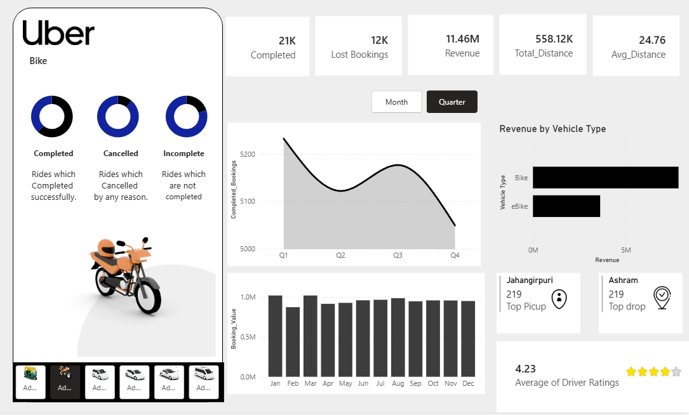

# Uber Rides Analytics Dashboard 🚗

An interactive data analytics dashboard built using **Power BI** to analyze Uber ride data across multiple vehicle types.

## Dashboard Overview

## Key Metrics
- **21K** Completed Rides
- **12K** Lost Bookings
- **11.46M** Total Revenue
- **558.12K** Total Distance
- **4.23** Average Driver Rating

## Features
- Booking analysis — Completed, Cancelled and Incomplete rides
- Revenue breakdown by Vehicle Type (Bike, eBike)
- Monthly and Quarterly booking trends
- Top Pickup and Drop locations
- Average driver rating tracker

## Tools Used
- Power BI (Dashboard & Visualizations)
- Microsoft Excel (Data Source)

## Files
- `Uber.pbix` — Power BI dashboard file
- `uber.xlsx` — Raw data source
